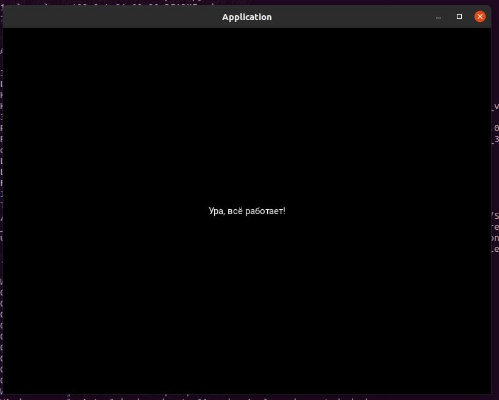

# **Getting started**

This guide is aimed to help to install all necessary requirements to run pain.py script from the article doi:10.1111/1000-7.
***
### **Installation guide:**
***
#### **System requirements**:

1. This script has ***only*** been tested on `Ubuntu 20.04`. Running it on different OS may require some extra actions. though it seems very likely to work on other linux distros just fine.

2. This particular guide uses `conda` to manage `python` global dependencies (*no apt install is required*). If you don't have `conda` installed please follow this full [conda install guide]('https://docs.conda.io/projects/conda/en/latest/user-guide/install/linux.html') (Anaconda and Miniconda will both satisfy following guide). You can also install newest version of `python` (*`3.10` as of October 21 2022*) **at your own risk** following this [`python 3.10` guide](https://computingforgeeks.com/how-to-install-python-on-ubuntu-linux-system/) and venv following [this guide](https://www.digitalocean.com/community/tutorials/how-to-install-python-3-and-set-up-a-programming-environment-on-ubuntu-20-04-quickstart) and skip Python and venv installation step, but it's strongly recommended to follow this guide. In general this script requires `python 3.10` or, probably, newer.

***

#### **Python 3.10 and venv installation:**

1. First, you need to create a new conda environment by running: 

    `conda create -n hw_3`

    Here i used hw_3 for conda environment name. It's highly recommended to stick to that name if you run this script for the first time unless you know exacly what you do and ready to take the risk.

2. Then run to switch to new `conda` environment:

    `conda activate hw_3`

    That should change (base) in you shell to (hw_3). Now we have isolated `conda` environment to install packages.

    You can exit conda environment by running:
    `conda deactivate` and see all of your conda environments by rinning `conda env list`. Active environment will be marked with asterix (*).
3. You can install python 3.10 by running: 

    `conda install python=3.10`

    After installation is done it's good to check your python version by punning `python3 --version`. This should return something like Python 3.10.x and path to currently used python. Note that `python3` adresses python in your current environment, while `python --version` will return default system python version.

4. Here we use conda to install venv by running: 

    `conda install -c anaconda virtualenv`
    
***

#### **Seting up virtual environment**

1. First. you need to create virtual env by running 

    `python3.10 -m venv hw_3_venv`, where hw_3_venv is name of the environment (can be chosen, but it's suggested to use same naming space here). This will create `hw_3_venv` in your working directory. It's suggested to run this command in the folder where pain.py and requirements.txt are situated.
    
    In general, venv is a useful tool to isolate your system environment from packages that are going to be installed to keep this script running. Using venv and conda is considered as a good paractice in development. You can see more on conda and venv [here](https://towardsdatascience.com/a-guide-to-conda-environments-bc6180fc533).

2. Next, you need to activate venv environment by running:

    `source hw_3_venv/bin/activate`. (hw_3_venv) will appear in your shell.

3. To setup all necessary python libraries you need to run:
    
    `pip3 install -r requirements.txt`

    `requirements.txt` can be found in the current repository. Basically this file allows to 'clone' pip package list to your current environment. We used `pip3` instead of `pip` here again in order to ensure that pip from environment will be used. You can see more on pip vs pip3 [here](https://www.pythonpool.com/pip-vs-pip3/#:~:text=PIP%20is%20a%20soft%20link,be%20installed%20in%20Python%203.).

***

#### **Running script *pain.py***

To run `pain.py` you need to run command:

`python3 pain.py` 

Please nore that is is considered that all actions take place in working directory (`requirements.txt` and `pain.py` are both in `./`). You can check it by running `ls` or `ll` shell commands. Use `cd` to change directory if nesessary. If you're unfamiliar with commnd-line tools please check this [article](https://kinsta.com/blog/linux-commands/).

If everything worked fine, a GUI interface will appear stating that everything works in russian.

***
#### **Finish!**

Now you can say what `1000-7` equals and you've probably started to like coffee even more.
